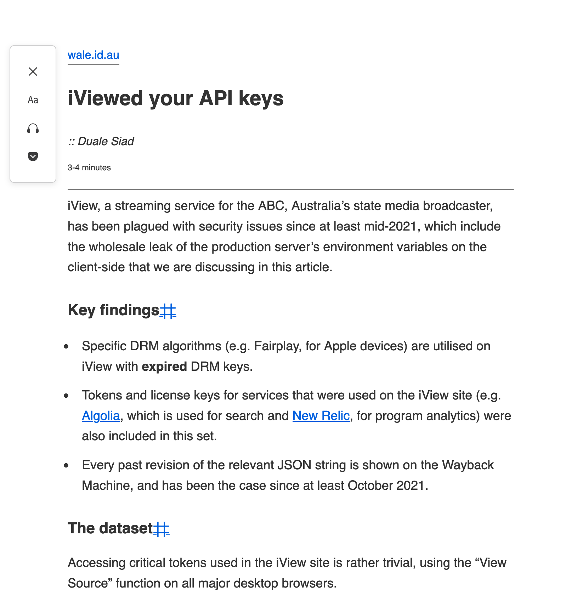

# Unclutter - Immersive Reading Mode

A new kind of reader mode to remove distractions from web articles.

## Installation

Try out the browser extension from the Chrome or Firefox extension stores ([or build it yourself](https://github.com/lindylearn/unclutter#development)):

## Features

The main difference between Unclutter and other "reader modes" is that it keeps the original style of websites intact ([see more here](docs/comparison.md)):

| Firefox reader mode                           | Unclutter                                       |
| --------------------------------------------- | ----------------------------------------------- |
|  |  |

Unclutter also supports:

-   Theme settings including a [dynamic dark mode](https://github.com/lindylearn/unclutter/blob/main/docs/theme.md).
-   [Automatically activating](https://github.com/lindylearn/unclutter/blob/main/docs/article-detection.md) the extension on a per-domain basis.
-   An interactive [page outline](https://github.com/lindylearn/unclutter/blob/main/docs/outline.md) to navigate long articles.
-   Showing [social highlights](https://github.com/lindylearn/unclutter/blob/main/docs/social-highlights.md) from Hacker News and Hypothes.is.
-   Taking [private notes](https://github.com/lindylearn/unclutter/blob/main/docs/annotations.md) by simply selecting text.

## How this works

The main "trick" is to use a website's responsive style to hide non-essential page elements for us (by [parsing & applying these rules in the CSSOM](source/content-script/modifications/CSSOM/responsiveStyle.ts)).
For other annoyances there are [global](source/content-script/modifications/contentBlock.ts) and [site-specific](source/content-script/pageview/manualContentBlock.css) blocklists based on CSS class naming.

To standardize margins, background colors, and font-sizes, the extension also [applies custom CSS](source/content-script/modifications/DOM/textContainer.ts) to text elements it finds in the DOM (with logic to detect what's the main article text). The dark mode feature uses a combination of [DOM and CSSOM iterations](source/content-script/modifications/CSSOM/theme.ts) to darken colors, change the background, or enable a website's native dark mode styles if present.

To tie these (and many more) page modifications together, they each hook into 8 lifecycle phases coordinated from [transitions.ts](source/content-script/transitions.ts). The major concern here is performance -- minimizing reflows while performing changes stepwise so that they look nice when animated.

Beyond this core functionality there are embedded React iframes to power the [social highlights & private notes features](source/sidebar/App.tsx) and the [extension settings page](source/settings-page/Options.tsx), Svelte components for the [UI controls](source/overlay) including the page outline, and [background event handling code](source/background/events.ts) to inject scripts into visited pages and handle events.

**For documentation on individual features see the [docs pages](https://github.com/lindylearn/unclutter/blob/main/docs).**

## Contributing

The main way you can help is to report bugs, broken articles pages, UI inconsistencies, or ideas on how to improve the extension by creating an [issue](https://github.com/lindylearn/unclutter/issues).

If you want something to be fixed faster (like a CSS bug), it may help to do it yourself. Please let me know if the docs pages and inline comments are not sufficient. Thank you in advance!

## Development

To build the extension yourself, run:

1. `yarn install && yarn build`
2. `yarn package`
3. Find the bundled extension code in `/web-ext-artifacts`. `_manifest-v2` is for Firefox, `_manifest-v3` for Chromium browsers.

I run this using node `v16.14.0` on Mac, then upload the bundled code to the Chrome and Mozilla extension stores manually. The bundling uses Rollup to create a somewhat readable output -- so feel free to check the released code in your browser's profile folder if you installed the extension.

For hot reloading during development, run `yarn watch` and `npx web-ext run` in parallel.

## Licence

This code is released under the [GNU GPLv3 License](https://choosealicense.com/licenses/gpl-3.0/), which requires commercial projects that build upon it to be open-source as well. The project is part of the [LindyLearn](http://lindylearn.io/) suite of free tools.

The private notes and social highlights feature uses code from the annotator subcomponent of [hypothesis/client](https://github.com/hypothesis/client) to anchor text fragments. See [LICENCE](https://github.com/lindylearn/annotations/blob/main/LICENCE) for the legal boilerplate.
