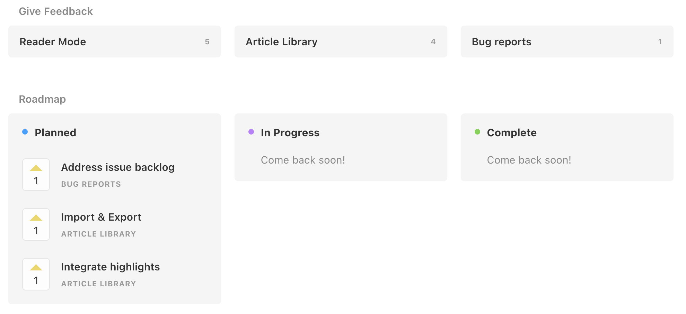

# Unclutter — Modern Reader Mode

Unclutter is a modern reader mode and article library for your browser.

## Why does it exist?

There many other "reader modes", but they all extract article text and re-render it their own format. Unclutter "unclutters" the original web pages itself, leaving the [original website styling](docs/comparison.md) and interactive elements intact.

Articles you read are automatically saved and organized in your Unclutter library, instead of having to maintain bookmark folders or manual tags.
Everything happens instantly in your browser.

<!-- 

 -->

Other features include:
-   [Crowdsourced blocklists](https://github.com/lindylearn/unclutter/blob/main/docs/element-blocking.md) for annoyances on specific websites
-   [Automatically activating](https://github.com/lindylearn/unclutter/blob/main/docs/article-detection.md) the reader mode
-   [Showing page chapters](https://github.com/lindylearn/unclutter/blob/main/docs/outline.md) to navigate long articles
-   [Integrated social comments](https://github.com/lindylearn/unclutter/blob/main/docs/social-highlights.md) from Hacker News and Hypothes.is
-   [Easily saving highlights](https://github.com/lindylearn/unclutter/blob/main/docs/annotations.md) by simply selecting text

Try it out for yourself:

## Get involved

The mission of Unclutter is to improve reading on the web for everyone. You should decide what, when, and how to read. What if you could automatically bypass paywalls or connect similar content across the web?

Here's how you can help:
- [Use the open roadmap](https://unclutter.canny.io/) to suggest new features for Unclutter or to vote on existing ideas.
- [Open GitHub issues](https://github.com/lindylearn/unclutter/issues) for bugs you find or for technical things to improve. All feedback from within the extension also automatically creates issues or Pull-Requests.
- [Join our Discord server](https://discord.gg/CThpNQjucB) if you want to contribute code!

<!--  -->

<!-- Also, please consider [supporting the project financially](https://opencollective.com/unclutter) if it is useful to you. All raised money will be split across all open-source contributors, administered by the Open Source Collective. This also unlocks additional features for your article library like AI categorization or a graph view of your captured information.

 -->

## Documentation

See the [docs pages](https://github.com/lindylearn/unclutter/blob/main/docs), or the [technical README](DEVELOPMENT.md). Please open an issue for any question you have!

## Licence

This project uses [GNU AGPLv3](https://choosealicense.com/licenses/gpl-3.0/), which requires commercial projects that use it to be open-source as well.

Unclutter exists thanks to everyone who contributes ideas or code, reports bugs, or simply uses the extension. Thank you!
