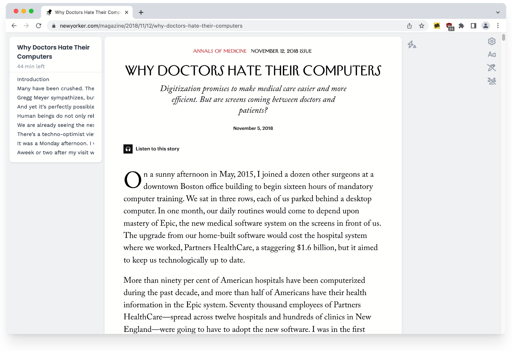
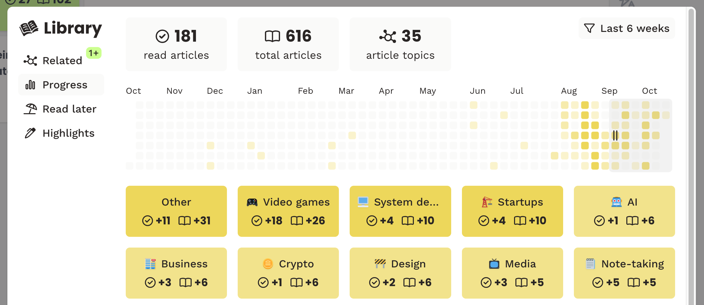

# Un-Medium — Modern Reader Mode

Un-Medium is a modern reader mode and article library for your browser, with a few twists!

Thank you [Unclutter](https://github.com/lindylearn/unclutter) for the code base of a great reader

## Why does it exist?

There many other "reader modes", but they all extract article text and re-render it their own format. Unclutter "unclutters" the original web pages itself, leaving their [visual style](docs/comparison.md) and interactive elements intact.

Articles you read with Unclutter are automatically saved and can be easily added to your read-it-later queue.
Everything happens instantly in your browser.

<!-- 

 -->

Other features include:

-   [Crowdsourced blocklists](https://github.com/lindylearn/unclutter/blob/main/docs/element-blocking.md) for annoyances on specific websites
-   [Automatically activating](https://github.com/lindylearn/unclutter/blob/main/docs/article-detection.md) the reader mode
-   [Showing page chapters](https://github.com/lindylearn/unclutter/blob/main/docs/outline.md) to navigate long articles
-   [Integrated social comments](https://github.com/lindylearn/unclutter/blob/main/docs/social-highlights.md) from Hacker News and Hypothes.is
-   [Easily saving highlights](https://github.com/lindylearn/unclutter/blob/main/docs/annotations.md) by simply selecting text

## Licence

This project uses [GNU AGPLv3](https://choosealicense.com/licenses/gpl-3.0/), which requires commercial projects that use it to be open-source as well.

Unclutter exists thanks to everyone who contributes ideas or code, reports bugs, or simply uses the extension. Thank you!

## DISCLAIMER

Use of this service is limited only to **non-sensitive and publicly available
data**. Users must not use, share, or store any kind of sensitive data like
health status, provision or payment of healthcare, Personally Identifiable
Information (PII) and/or Protected Health Information (PHI), etc. under **ANY**
circumstance.

Administrators for this service reserve the right to moderate all information
used, shared, or stored with this service at any time. Any user that cannot
abide by this disclaimer and Code of Conduct may be subject to action, up to
and including revoking access to services.

The material embodied in this software is provided to you "as-is" and without
warranty of any kind, express, implied or otherwise, including without
limitation, any warranty of fitness for a particular purpose. In no event shall
the Centers for Disease Control and Prevention (CDC) or the United States (U.S.)
government be liable to you or anyone else for any direct, special, incidental,
indirect or consequential damages of any kind, or any damages whatsoever,
including without limitation, loss of profit, loss of use, savings or revenue,
or the claims of third parties, whether or not CDC or the U.S. government has
been advised of the possibility of such loss, however caused and on any theory
of liability, arising out of or in connection with the possession, use or
performance of this software.

## Disclaimer of Liability:

The information provided in Un-Medium Learning Project is for general informational purposes only. GiveMeSomething assumes no responsibility for errors or omissions in the contents of the project. In no event shall GiveMeSomething be liable for any special, direct, indirect,
