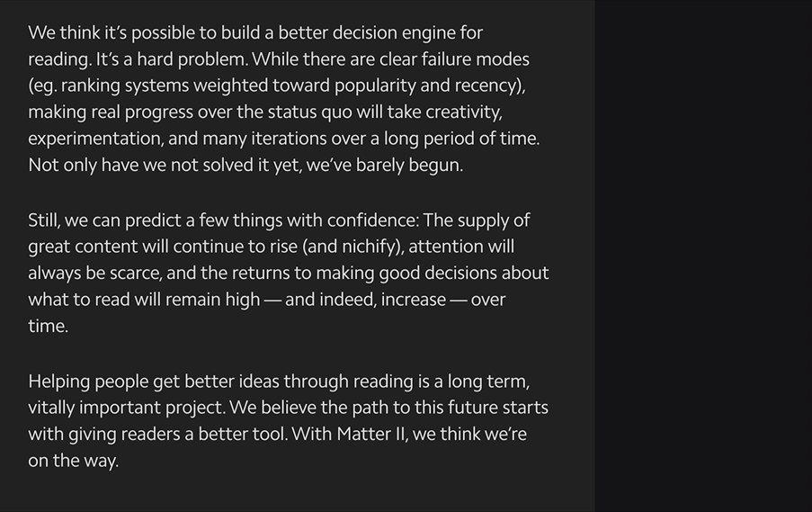

# Annotations Sync

Unclutter supports the highlighting and annotating of articles so that you that you can easily remember the things you read.

By default, all of your "private notes" are saved in your local browser storage and appear every time you open an article. If you want to access your notes on different devices, organize, or import them into note-taking apps, you can configure a synchronization with [Hypothes.is](https://web.hypothes.is).

If you configure the Hypothes.is synchronization, you can also make any of your article notes publicly visible by clicking the "globe" icon. Other users can then reply to your idea just like you can reply to theirs.

## Setup

1. [Create a free Hypothes.is account](https://hypothes.is/signup?utm_source=lindylearn.io) if you don't already have one.
2. [Generate your API token](https://hypothes.is/account/developer) and enter it in the Unclutter extensions settings.
3. From now on, notes will be stored on Hypothes.is rather than in your browser storage. All existing local annotations will be uploaded automatically.
4. You can now browse and search across your annotations on your [hypothes.is profile](https://hypothes.is/users/peterhagen), or using [Lindy Annotations](http://annotations.lindylearn.io/) (this only works for public annotations).
