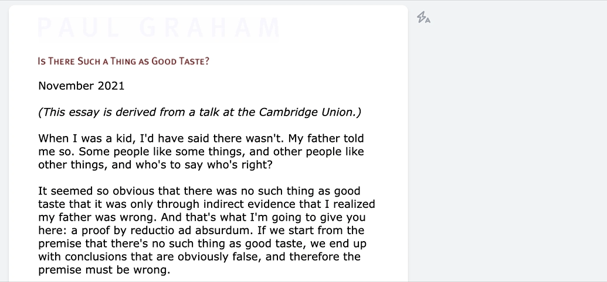
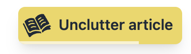

# Automatic activation

You can configure Unclutter to automatically activate on certain domains by clicking the "flash" icon next to each article:

This avoids having to click the extension icon each time you're on a certain blog. In the settings you can also configure this automatic activation to be created each time you click the extension icon -- this saves the click on the "flash" icon.

## Unclutter reminder

Another related feature shows a timed button in the top right of all article pages you visit. This is also meant to make it easier to activate Unclutter, but you'll have to manually activate it in the extension settings.

## Detecting non-leaf pages

Both the automatic activation and the unclutter reminder only apply to article pages, and not your bank website.

To detect article pages, Unclutter uses the following heuristics:

-   Exclude popular social non-article websites.
-   Never activate on URLs at the root of a domain (`/`), or on paths that end with `.pdf`.
-   Never activate on URLs that contain fewer than 2 dashes (`-`).
    -   Motivation: most articles contain their title in the URLs, whereas directory pages do not.
    -   However, this check does not apply to URLs that contain `/posts/`, `/wiki/`, `/blog/`, or `/articles/`.

See the implementation and URL examples in [common/articleDetection.js](https://github.com/lindylearn/unclutter/blob/main/source/common/articleDetection.js).

| 🐛     **Is this not working as expected or could be better? Please [open an issue](https://github.com/lindylearn/unclutter/issues/new) for it!** |
| ------------------------------------------------------------------------------------------------------------------------------------------------- |
