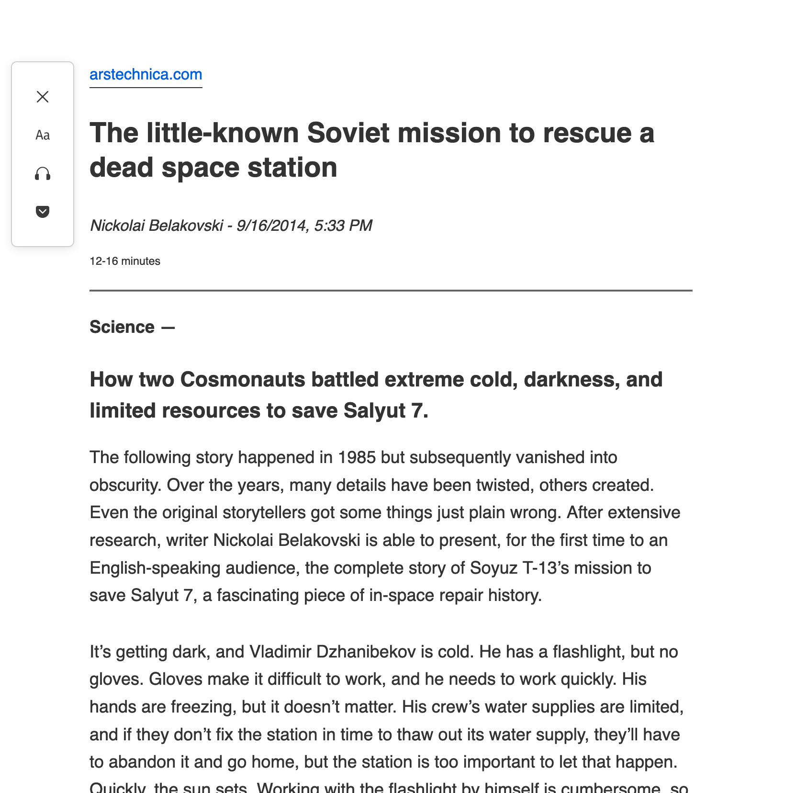
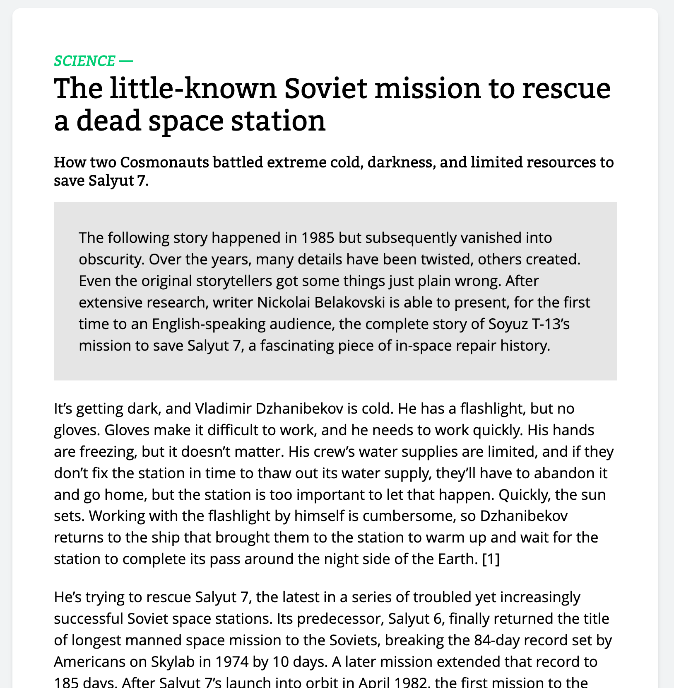

# Comparison to other reader modes

Unlike every other "reader mode", Unclutter modifies the HTML of article pages instead of replacing it. The goal behind this is to improve readability without making all pages look the same (which is one of the most fun parts of the internet).

Here's the Firefox default reader mode vs Unclutter:

| Firefox                                          | Unclutter                                          |
| ------------------------------------------------ | -------------------------------------------------- |
|  |  |
|  |  |

In addition, Unclutter also supports many more features likes [page outlines](https://github.com/lindylearn/unclutter/blob/main/docs/outline.md), [social highlights](https://github.com/lindylearn/unclutter/blob/main/docs/social-highlights.md), or [automatic activation](https://github.com/lindylearn/unclutter/blob/main/docs/article-detection.md).

For a short intro to how it works technically, see [README.md](https://github.com/lindylearn/unclutter#how-this-works).

| 🐛     **Is this not working as expected or could be better? Just [open a short issue](https://github.com/lindylearn/unclutter/issues/new) for it!** |
| ---------------------------------------------------------------------------------------------------------------------------------------------------- |
