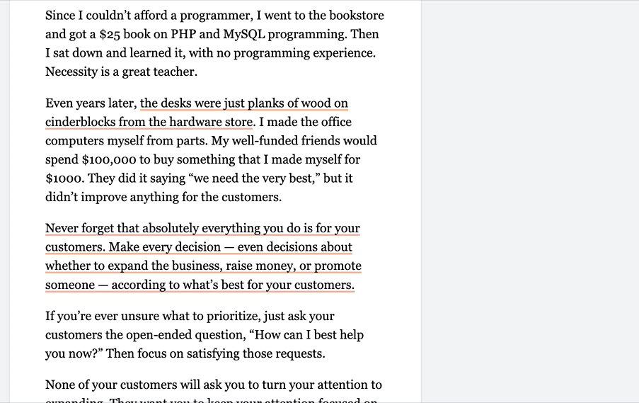

# Social Highlights

Unclutter shows related social conversations for 85,643+ articles directly within the extension:

The idea is to make it easy to find the important quotes of each article.

If you want to see more, click on any text that's underlined in orange or red to see the conversation about it. This works particularly well on articles that are popular on [Hacker News](https://hn.lindylearn.io/best) or [Hypothes.is](https://annotations.lindylearn.io/domain/theatlantic.com).

## How this works

I parsed every [Hacker News](https://news.ycombinator.com) comment with a quote in it (lines starting with `>`, `*`, or `"`), and searched this quote in the article the comment is about. If the text search succeeds, the comment is anchored on the page just like [privates notes](https://github.com/lindylearn/unclutter/blob/main/docs/annotations.md) are within Unclutter.

When you open an article that has social comments like this, Unclutter will underline the related quotes in the article text itself. If a comments looks more like spam than interesting side-note, hover over the comment box and click "Remove comment". Or you can entirely disable the feature via the toolbar in the top right.

The shown social highlights also include web annotations from [Hypothes.is](https://hypothes.is). So if you want to created your own social highlight for other people to see and reply to, configure the [Hypothes.is sync](https://github.com/lindylearn/unclutter/blob/main/docs/annotations.md) within Unclutter.

## Privacy

Social highlights are fetched from the backend using the SHA256 hash of the normalized article URL, so I do not see which articles you read.

The number of social highlights for an URL you're visiting also appears on the Unclutter extension icon (which can be turned off in the settings). **This works without any network requests:** Every time Unclutter updates, it downloads the latest list of supported articles and then uses it locally to show the social highlight count (see [annotationCounts.ts](https://github.com/lindylearn/unclutter/blob/main/source/background/annotationCounts.ts)).

| 🐛     **Is this not working as expected or could be better? Please [open an issue](https://github.com/lindylearn/unclutter/issues/new) for it!** |
| ------------------------------------------------------------------------------------------------------------------------------------------------- |
