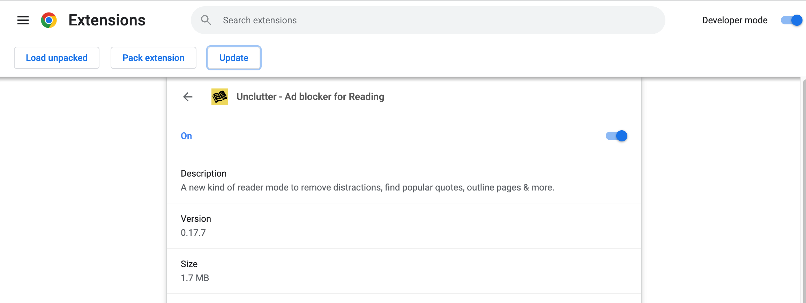

# Updating Unclutter

Your browser automatically updates extensions for you in the background -- but this can take a few days.
Since Unclutter updates fairly frequently, you may not be running the latest version.

You can manually trigger the extension to update if you want new features to work immediately. Here's how this works:

## For Chrome

1. Go to the extension settings page by right-clicking the Unclutter extension icon and selecting "Manage extension". Or enter `chrome://extensions/?id=ibckhpijbdmdobhhhodkceffdngnglpk` in the URL bar.
2. Enable "Developer mode" in the top right of the screen.
3. In the toolbar that shows up, click "Update" (it should be the 3rd button).
4. That's it! You can now disable the developer mode again.

## For Firefox

1. Go to the extension settings page by right-clicking the Unclutter extension icon and selecting "Manage extension".
2. Click on the settings icon in the top right of the page.
3. Click "Check for updates", which should be in the first row.
