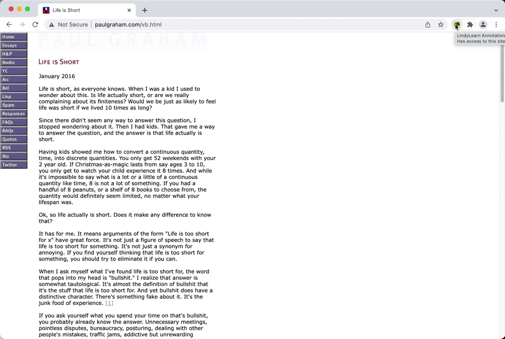

# LindyLearn Annotations

A simple browser extension to highlight, annotate, and talk about great articles.

## Features

-   Take notes and highlight ideas on articles right in your browser, then synchronize them to your notes app.
-   Uses your existing [hypothes.is](https://web.hypothes.is) account to save annotations.
-   One click for everything: simply selecting text creates a highlight, editing a note updates it, there's a switch to make annotations public or private.
-   The annotation sidebar stays open, so you always see all your in-progress notes while reading.
-   In addition to public web annotations, the extension also shows inline quote comments parsed from Hacker News.

## Installation

Until the extension is approved for the Chrome and Firefox stores, you need to install it manually.

For Chrome:

1. Download the latest extension `.zip` file from [/releases](https://github.com/lindylearn/annotations/releases).
2. Extract the downloaded .zip file in your Downloads folder.
3. Visit `chrome://extensions/` and enable `Developer mode` in the top right.
4. Click `Load unpacked` in the top left of the same page, and select the extracted folder.

Unfortunately it's not currently possible to install the extension for Firefox (it needs to pass a review even for self-distributed extensions).

<!-- 1. Visit `about:addons` and click on the settings icon in the top right.
2. Select `Install Add-on From File...` and select the .zip file you downloaded. -->

## Usage

After installing the browser extension, move the "book" icon to your extension bar. Clicking it will reduce the size of the webpage in your active tab and show annotations on the right. This should work on any page, but sometimes there are CSS issues (please open an issue for those!) Clicking the icon again restores the original page.

The extension sidebar shows public web annotations and quote comments from Hacker News. If you link your [hypothes.is](https://web.hypothes.is) account it also shows your private annotations and highlights. On many older articles there will be graph of social references to that link over time.

If you're logged in and the annotations sidebar is open, selecting any text on the webpage will create a private highlight. Optionally you can add a note or tags separated by `", "`. All edits are automatically synchronized with your hypothes.is account. If you want to talk about one of your notes, make it public by toggling the switch on that annotation.

## Development

To build the extension yourself, run:

1. `yarn install && yarn build`
2. `npx web-ext build`
3. Find the bundled extension code in `/web-ext-artifacts`.

This was tested using node `v17.6.0` and yarn `1.22.17` on Mac, but should work the same in other environments. See `source/README.me` for some documentation on the code structure.

For hot reloading during development, run `yarn watch` and `npx web-ext run` in parallel.

## License

This project is a simplified rewrite of the official Hypothes.is browser extension. It uses a few code pieces of it, particularly the "annotator" component to anchor text on webpages. See [LICENSE](https://github.com/lindylearn/annotations/blob/main/LICENCE) for details.
