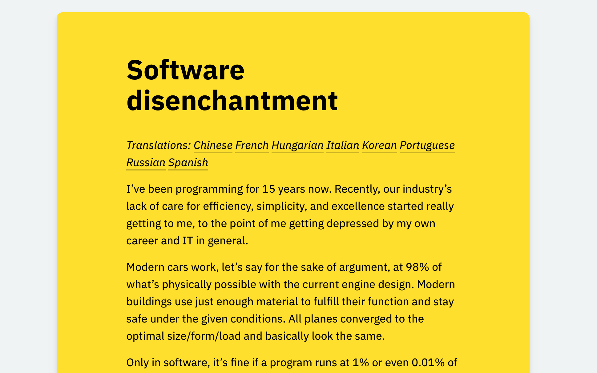

# LindyLearn Annotations

A simple browser extension to simplify web articles and annotate them.

## Features

-   Rewrites a website's CSS to use mobile styles even at larger viewports. This usually increases readability since column widths are shorter and margins smaller.
-   Simplifies pages by removing headers, sidebars, banners, or any other HTML elements not related to the content.
-   More to come :)

<!-- -   Take notes and highlight ideas on articles right in your browser, then synchronize them to your notes app. Uses your existing [hypothes.is](https://web.hypothes.is) account to save annotations.
-   One click for everything: simply selecting text creates a highlight, editing a note updates it, there's a switch to make annotations public or private.
-   The annotation sidebar stays open, so you always see all your in-progress notes while reading.
-   In addition to public web annotations, the extension also shows inline quote comments parsed from Hacker News. -->

## Installation

Install the extension from the [Chrome Web Store](https://chrome.google.com/webstore/detail/lindylearn-annotations/ibckhpijbdmdobhhhodkceffdngnglpk) or [Mozilla Add-on Store](https://addons.mozilla.org/en-GB/firefox/addon/lindylearn-annotations/).

## Usage

After installing the browser extension, move the "book" icon to your extension bar. Clicking the icon will reduce the size of the active webpage and simplify it. Clicking on the background outside the article restores the original page.

In theory this should work on any page, but sometimes there are CSS issues -- please open an issue for those!

<!-- The extension sidebar shows public web annotations and quote comments from Hacker News. If you link your [hypothes.is](https://web.hypothes.is) account it also shows your private annotations and highlights. On many older articles there will be graph of social references to that link over time.

If you're logged in and the annotations sidebar is open, selecting any text on the webpage will create a private highlight. Optionally you can add a note or tags separated by `", "`. All edits are automatically synchronized with your hypothes.is account. If you want to talk about one of your notes, make it public by toggling the switch on that annotation. -->

## Development

To build the extension yourself, run:

1. `yarn install && yarn build`
2. `yarn package`
3. Find the bundled extension code in `/web-ext-artifacts` (`_manifest-v2`). `_manifest-v2` is for Firefox, `_manifest-v3` for Chromium browsers.

This was tested using node `v17.6.0` and yarn `1.22.17` on Mac, but should work the same in other environments. See `source/README.me` for some documentation on the code structure.

For hot reloading during development, run `yarn watch` and `npx web-ext run` in parallel.

## License

<!-- This project is a simplified rewrite of the official Hypothes.is browser extension. It uses a few code pieces of it, particularly the "annotator" component to anchor text on webpages.  -->

See [LICENSE](https://github.com/lindylearn/annotations/blob/main/LICENCE) for details.
